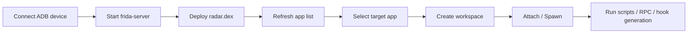

# Frida-Hookers

[](https://opensource.org/licenses/MIT)


`Frida-Hookers` 是一个面向 Android 动态调试场景的本地工作台，用来把分散的 Frida 调试准备工作收敛成一套统一流程：

- 连接 ADB 设备
- 启动匹配架构的 `frida-server`
- 部署 `radar.dex`
- 选择目标 App
- 初始化该 App 的独立工作区
- attach / spawn 注入 Frida JS
- 查询 Activity / Service / Object / View

它不是一个“通用 APK 分析器”，而是一个围绕**单个目标 App 持续调试**的本地工程化外壳。

当前代码提供两个入口，其中 **GUI 是推荐的主入口**：

- GUI: `app_gui.py`
- CLI: `hookers.py`


## Demo / 演示

GUI 主界面：


Hook 注入过程：


---

## 1. 为什么用 Frida-Hookers / Why Frida-Hookers

如果你平时做 Android Frida 调试，通常会不断重复这些动作：

- 手动确认设备和 root 状态
- 手动启动 `frida-server`
- 手动部署辅助资源
- 每次重新准备脚本目录
- 每次重新拉 APK、记包名、切 attach / spawn

`Frida-Hookers` 的目标不是替代 Frida，而是把这些重复劳动前移成可复用的工程结构。当前代码里，这套职责被拆成了清晰的 service 层：

- [core/device_service.py](C:/Users/mengze/Desktop/hooker-master/core/device_service.py:15)：设备连接、root 检查、`frida-server`、`radar.dex`
- [core/workspace_service.py](C:/Users/mengze/Desktop/hooker-master/core/workspace_service.py:31)：`workspaces/<package>/` 工作区、脚本复制、APK 拉取
- [core/session_service.py](C:/Users/mengze/Desktop/hooker-master/core/session_service.py:57)：attach / spawn 会话生命周期
- [core/rpc_service.py](C:/Users/mengze/Desktop/hooker-master/core/rpc_service.py:13)：`rpc.js` 调用、页面查询、hook 脚本生成

---

## 2. 当前能力 / What It Does

基于当前代码，这个项目已经支持：

- 自动连接 ADB 设备并检测 root / Magisk
- 按 CPU 架构选择并启动 `frida-server`
- 在 GUI 中切换 `Frida sever选择`：
  - `正常 Frida sever`：使用项目内置标准 `frida-server`
  - `过检测 Florid sever`：使用 `mobile-deploy/florida-server-16.7.19`
- 部署 `radar.dex`
- 枚举设备上的 App，并把目标 App 拉到前台或以 spawn 方式准备注入
- 为每个包名生成独立工作区 `workspaces/<package>/`
- 自动复制内置 Frida JS 模板并拉取目标 APK
- 通过 CLI 或 GUI 发起 attach / spawn 注入
- 通过 `rpc.js` 查询 Activity / Service / Object / View 信息
- 通过 `gs` / GUI 动作生成 hook 脚本

这些能力分别落在：

- 设备准备：[core/device_service.py](C:/Users/mengze/Desktop/hooker-master/core/device_service.py:27)
- 工作区初始化：[core/workspace_service.py](C:/Users/mengze/Desktop/hooker-master/core/workspace_service.py:112)
- 会话生命周期：[core/session_service.py](C:/Users/mengze/Desktop/hooker-master/core/session_service.py:139)
- RPC 与 hook 生成：[core/rpc_service.py](C:/Users/mengze/Desktop/hooker-master/core/rpc_service.py:108)

---

## 3. 运行流程 / Runtime Flow

下面这条链路就是项目最核心的使用路径：



这条流程在 CLI 和 GUI 中都存在，但当前项目更推荐从 GUI 开始：

- GUI 只负责装配 context + services，设备准备需要用户手动点击触发，见 [app_gui.py](C:/Users/mengze/Desktop/hooker-master/app_gui.py:15)
- CLI 会在启动时直接执行 bootstrap，见 [hookers.py](C:/Users/mengze/Desktop/hooker-master/hookers.py:75)

---

## 4. 快速开始 / Quick Start

### 4.1 Requirements

开始前请确认：

- Windows
- Python 3.12 或 3.13
- `adb` 已安装并且在 PATH 中可直接执行
- 已连接 Android 设备
- 目标设备已 root
- `mobile-deploy/` 中存在与你设备架构匹配的 `frida-server`

当前代码里的关键假设：

- `hookers.py` 启动时会直接执行 bootstrap，见 [hookers.py](C:/Users/mengze/Desktop/hooker-master/hookers.py:75)
- bootstrap 会依次调用 `connect()`、`start_frida_server()`、`deploy_radar_dex()`、`refresh_applications()`，见 [hookers.py](C:/Users/mengze/Desktop/hooker-master/hookers.py:85)
- `DeviceService.start_frida_server()` 当前只内建了 `arm` / `arm64` 的资源选择逻辑，见 [core/device_service.py](C:/Users/mengze/Desktop/hooker-master/core/device_service.py:167)

如果设备没有 root，或 `frida-server` 架构不匹配，核心流程基本无法正常工作。

### 4.2 Install

使用 `venv`：

```powershell
python -m venv .venv
.venv\Scripts\activate
pip install -r requirements.txt
```

使用 `uv`：

```powershell
uv venv
.venv\Scripts\activate
uv pip install -r requirements.txt
```

当前 Python 依赖见 [requirements.txt](C:/Users/mengze/Desktop/hooker-master/requirements.txt:1)，主要包括：

- `frida`
- `frida-tools`
- `adbutils`
- `PySide6`
- `prompt_toolkit`
- `jsbeautifier`

### 4.3 First Run

至少先确认这些本地资源存在：

- `js/`
- `mobile-deploy/radar.dex`
- `mobile-deploy/frida-server-16.7.19-android-arm`
- `mobile-deploy/frida-server-16.7.19-android-arm64`
- `mobile-deploy/florida-server-16.7.19`（用于 GUI 中的 `过检测 Florid sever` 选项）

推荐的首次体验方式是 **先用 GUI 跑完整工作流**：

```powershell
python app_gui.py
```

GUI 启动后建议按这个顺序操作：

1. 先在 `Frida sever选择` 中确认本次要使用的 server：
   - 常规场景选 `正常 Frida sever`
   - 默认 `frida-server` 容易被检测时，切到 `过检测 Florid sever`
2. 点击“准备环境并刷新 App”
3. 选择目标 App
4. 如有需要，点击“初始化工作目录并拉取 APK”
5. 在左侧选择脚本，或用“生成 Hook 脚本”快速生成新脚本
6. 选择 `Attach` 或 `Spawn`
7. 点击“开始注入”
8. 在右侧日志区查看输出，或继续使用 Activity / Service / Object / View 工具

当前 GUI 的 server 选择是**本次运行时生效**的，不写入配置文件。设备准备时会：

- 根据下拉选项选择标准 `frida-server` 或 `florida-server`
- 将目标二进制匿名部署到 `/data/local/tmp/fr/`
  - 标准 Frida 使用 `fri-ser`
  - Florida 使用 `flo-ser`
- 每次点击“准备环境并刷新 App”前，先清理 `/data/local/tmp/fr` 下已有的匿名 server 文件与对应进程
- 关闭 GUI 时，也会尽量再清理一次 `/data/local/tmp/fr`

这套 GUI 编排都落在 [ui/main_window.py](C:/Users/mengze/Desktop/hooker-master/ui/main_window.py:63)，而入口装配在 [app_gui.py](C:/Users/mengze/Desktop/hooker-master/app_gui.py:15)。

注意：GUI 启动后**不会自动准备设备环境**，你需要手动点击“准备环境并刷新 App”。

如果你更偏向终端，也可以直接运行：

```powershell
python hookers.py
```

CLI 启动后会自动执行：

1. 连接 ADB 设备
2. 启动 `frida-server`
3. 部署 `radar.dex`
4. 刷新 App 列表

这部分行为来自 [HookersCli.bootstrap()](C:/Users/mengze/Desktop/hooker-master/hookers.py:75)。

---

## 5. 仓库结构 / Repository Layout

```text
hooker-master/
├─ app_gui.py
├─ hookers.py
├─ README.md
├─ AGENT.md
├─ LICENSE
├─ requirements.txt
├─ core/
│  ├─ models.py
│  ├─ device_service.py
│  ├─ workspace_service.py
│  ├─ session_service.py
│  └─ rpc_service.py
├─ ui/
│  ├─ main_window.py
│  └─ workers/
├─ js/
├─ mobile-deploy/
└─ workspaces/
   └─ <package-name>/
```

说明：

- `core/`：核心业务层
- `ui/`：GUI 层
- `js/`：全局 Frida JS 模板
- `mobile-deploy/`：设备部署资源
- `workspaces/<package-name>/`：按目标 App 自动生成的本地工作区

工作区目录不是框架核心源码，而是运行时产物。对应逻辑见 [core/workspace_service.py](C:/Users/mengze/Desktop/hooker-master/core/workspace_service.py:36)。

---

## 6. GUI 使用方式

GUI 是对同一套 `core/` service 的可视化编排，不是单独的另一套底层逻辑。

推荐操作顺序：

1. 启动 `python app_gui.py`
2. 在 `Frida sever选择` 中选择 `正常 Frida sever` 或 `过检测 Florid sever`
3. 点击“准备环境并刷新 App”
4. 选择目标 App
5. 如有需要，初始化工作目录并拉取 APK
6. 选择脚本
7. 选择 `Attach` 或 `Spawn`
8. 点击“开始注入”
9. 在右侧日志区观察输出

GUI 中的高频动作包括：

- 准备设备环境
- 切换本次运行使用的 Frida server 变体
- 刷新 App 列表
- 初始化工作区
- 启动 / 停止 Hook
- 查看 Activity / Service 信息
- 查看 Object / View 信息
- 生成 hook 脚本

相关入口见：

- [app_gui.py](C:/Users/mengze/Desktop/hooker-master/app_gui.py:34)
- [ui/main_window.py](C:/Users/mengze/Desktop/hooker-master/ui/main_window.py:63)

当前 GUI 实际界面如下：


### 6.1 调试工具区怎么用

中间这块“调试工具”面板，主要对应三类动作：脚本生成、对象分析、页面查询。它们都通过 [RpcService](C:/Users/mengze/Desktop/hooker-master/core/rpc_service.py:13) 调用 `js/rpc.js` 完成，按钮逻辑在 [ui/main_window.py](C:/Users/mengze/Desktop/hooker-master/ui/main_window.py:1372)。


使用这些按钮前，至少要先满足两点：

1. 已点击“准备环境并刷新 App”
2. 已选择目标 App

如果当前已经有活动 Hook 会话，GUI 会优先复用当前上下文；如果没有，会先确保目标 App 进入可用状态。

### 6.2 脚本生成

输入框提示是：

`输入类名或类名:方法，例如 com.demo.Test:onCreate`

这里支持两种常见写法：

- 只填类名
  - 例如 `com.demo.Test`
  - 会为这个类生成“全方法 hook”脚本
- 填 `类名:方法`
  - 例如 `com.demo.Test:onCreate`
  - 会只针对这个方法生成脚本

点击“生成 Hook 脚本”后，GUI 会：

1. 调用 `rpc.js` 判断类是否存在
2. 生成对应的 hook 代码
3. 把脚本保存到 `workspaces/<package>/js/`
4. 自动刷新左侧脚本下拉框，并尽量自动选中新生成的脚本

对应代码见：

- [RpcService.generate_hook_script()](C:/Users/mengze/Desktop/hooker-master/core/rpc_service.py:126)
- [MainWindow.generate_hook_script()](C:/Users/mengze/Desktop/hooker-master/ui/main_window.py:1372)

### 6.3 对象分析

对象分析区共用一个输入框：

`输入对象 ID、类名或 View ID`

这一区域的三个按钮分别对应：

- “对象信息”
  - 调用 `object_info`
  - 用来查看某个对象或类的详细字段/结构信息
- “对象解释”
  - 调用 `object_to_explain`
  - 在对象信息基础上做进一步解释
- “View 信息”
  - 调用 `view_info`
  - 用来查看某个 View 的详细信息

如果输入为空，GUI 会直接报错，不会发请求。对应逻辑见：

- [MainWindow.inspect_target()](C:/Users/mengze/Desktop/hooker-master/ui/main_window.py:1134)
- [MainWindow.show_object_info()](C:/Users/mengze/Desktop/hooker-master/ui/main_window.py:1444)
- [MainWindow.show_object_explain()](C:/Users/mengze/Desktop/hooker-master/ui/main_window.py:1467)
- [MainWindow.show_view_info()](C:/Users/mengze/Desktop/hooker-master/ui/main_window.py:1490)

### 6.4 页面查询

这一组不需要额外输入框：

- “查看 Activity”
  - 查询当前 App 的 Activity 信息
- “查看 Service”
  - 查询当前 App 的 Service 信息
- “重启 App”
  - 先停止当前活动会话，再重启 App，并刷新应用列表与 PID 状态

对应入口见：

- [MainWindow.show_activities()](C:/Users/mengze/Desktop/hooker-master/ui/main_window.py:1408)
- [MainWindow.show_services()](C:/Users/mengze/Desktop/hooker-master/ui/main_window.py:1426)
- [MainWindow.restart_current_app()](C:/Users/mengze/Desktop/hooker-master/ui/main_window.py:1513)

### 6.5 结果会显示在哪里

这些工具按钮的结果通常会显示在两个地方：

- 右侧日志区
  - 记录当前动作是否触发、是否成功
- 非模态结果窗口
  - Activity / Service / 对象 / View 查询结果会弹出单独窗口显示

脚本生成动作则会把结果落到本地工作区，并在状态栏和弹窗中提示生成位置。

---

## 7. CLI 简要说明

CLI 仍然可用，但现在更适合作为：

- 启动时快速验证设备环境
- 习惯终端工作流时做单 App 调试
- 不想打开 GUI 时快速 attach / spawn 某个脚本

启动 `python hookers.py` 后，它会先执行 bootstrap，然后进入两层交互式流程：

1. App 选择层：输入包名、`refresh` 或 `exit`
2. 单 App 调试层：围绕当前 App 执行 attach / spawn / RPC 查询 / hook 生成

常用命令包括：

- `ls`
- `attach <script.js>`
- `spawn <script.js>`
- `activitys`
- `services`
- `object <id|class>`
- `view <id>`
- `gs <class[:method[(args)]]>`
- `restart`

如果你需要尽早拦截启动逻辑、证书校验或初始化行为，通常应先尝试 `spawn`。脚本运行后可在 CLI 中按 `Ctrl + C` 停止。

相关入口见：

- [HookersCli.print_debug_help()](C:/Users/mengze/Desktop/hooker-master/hookers.py:162)
- [HookersCli.select_app()](C:/Users/mengze/Desktop/hooker-master/hookers.py:232)
- [SessionService.attach_script()](C:/Users/mengze/Desktop/hooker-master/core/session_service.py:176)
- [SessionService.spawn_script()](C:/Users/mengze/Desktop/hooker-master/core/session_service.py:198)

一个最小 CLI 示例：

```text
python hookers.py
hooker(包名): com.example.demo
com.example.demo > ls
com.example.demo > attach okhttp.js
CTRL + C to stop >
```

---

## 8. 工作区机制

这个项目的一个核心设计是：**每个包名一个本地工作区**。

当你选中某个 App 并初始化工作区后，项目会在 `workspaces/` 下生成类似：

```text
workspaces/
└─ com.example.demo/
   ├─ attach.bat
   ├─ spawn.bat
   ├─ kill.bat
   ├─ objection.bat
   ├─ hooking.bat
   ├─ SomeApp_1.2.3.apk
   └─ js/
      ├─ okhttp.js
      ├─ url.js
      └─ ...
```

这些内容不是手工维护，而是由 `WorkspaceService` 生成：

- 工作区目录：[core/workspace_service.py](C:/Users/mengze/Desktop/hooker-master/core/workspace_service.py:36)
- 轻量工作区壳：[core/workspace_service.py](C:/Users/mengze/Desktop/hooker-master/core/workspace_service.py:74)
- 首次完整初始化：[core/workspace_service.py](C:/Users/mengze/Desktop/hooker-master/core/workspace_service.py:109)

内置模板脚本来自全局 `js/` 目录，初始化时会复制到 `workspaces/<package>/js/`。  
对应逻辑见 [core/workspace_service.py](C:/Users/mengze/Desktop/hooker-master/core/workspace_service.py:93)。

---

## 9. 内置脚本与 RPC

`js/` 目录包含全局模板脚本，例如：

- `okhttp.js`
- `url.js`
- `just_trust_me.js`
- `DumpDex.js`
- `bypass_root_detect.js`
- `bypass_vpn_detect.js`
- `keystore_dump.js`
- `rpc.js`

其中几个关键脚本：

- `js/rpc.js`
  - 为 `RpcService` 提供导出方法
- `js/_hook_js_prepare.js`
  - 生成 hook 脚本时的前置模板
- `js/_hook_js_enhance.js`
  - 生成 hook 脚本时追加的辅助逻辑
- `js/_hook_js_warp.js`
  - 注入脚本时统一拼接的包装逻辑

对应生成逻辑见 [RpcService.generate_hook_script()](C:/Users/mengze/Desktop/hooker-master/core/rpc_service.py:73)。

额外说明：

- `just_trust_me.js` 在 CLI / GUI 中会自动切换到 V8 runtime  
  见 [hookers.py](C:/Users/mengze/Desktop/hooker-master/hookers.py:213) 和 [ui/workers/hook_worker.py](C:/Users/mengze/Desktop/hooker-master/ui/workers/hook_worker.py:50)

---

## 10. 架构概览

这个项目已经从“单脚本堆逻辑”拆成了“共享上下文 + service + CLI/GUI 外壳”的结构。

### 10.1 共享状态

[core/models.py](C:/Users/mengze/Desktop/hooker-master/core/models.py:13) 定义了：

- `AppRecord`
- `AppContext`
- `HookSession`
- `HookerContext`

其中 `HookerContext` 是 service 协作的状态中心。

### 10.2 service 层

- [DeviceService](C:/Users/mengze/Desktop/hooker-master/core/device_service.py:15)
  - 设备连接、root 检测、前台切换、`frida-server` 启动、`radar.dex` 部署
- [WorkspaceService](C:/Users/mengze/Desktop/hooker-master/core/workspace_service.py:31)
  - 工作区、脚本复制、APK 拉取、输出保存
- [SessionService](C:/Users/mengze/Desktop/hooker-master/core/session_service.py:57)
  - attach / spawn、脚本加载、会话清理、消息处理
- [RpcService](C:/Users/mengze/Desktop/hooker-master/core/rpc_service.py:13)
  - 临时 RPC 调用、对象查询、hook 生成

### 10.3 GUI 层

GUI 主要由这些文件组成：

- [app_gui.py](C:/Users/mengze/Desktop/hooker-master/app_gui.py:15)
- [ui/main_window.py](C:/Users/mengze/Desktop/hooker-master/ui/main_window.py:63)
- [ui/workers/device_worker.py](C:/Users/mengze/Desktop/hooker-master/ui/workers/device_worker.py:8)
- [ui/workers/workspace_worker.py](C:/Users/mengze/Desktop/hooker-master/ui/workers/workspace_worker.py:8)
- [ui/workers/hook_worker.py](C:/Users/mengze/Desktop/hooker-master/ui/workers/hook_worker.py:9)
- [ui/workers/action_worker.py](C:/Users/mengze/Desktop/hooker-master/ui/workers/action_worker.py:8)

---

## 11. 建议的阅读顺序

如果你准备继续开发，建议按这个顺序阅读：

1. [core/models.py](C:/Users/mengze/Desktop/hooker-master/core/models.py:13)
2. [hookers.py](C:/Users/mengze/Desktop/hooker-master/hookers.py:40)
3. [app_gui.py](C:/Users/mengze/Desktop/hooker-master/app_gui.py:15)
4. [core/device_service.py](C:/Users/mengze/Desktop/hooker-master/core/device_service.py:15)
5. [core/workspace_service.py](C:/Users/mengze/Desktop/hooker-master/core/workspace_service.py:31)
6. [core/session_service.py](C:/Users/mengze/Desktop/hooker-master/core/session_service.py:57)
7. [core/rpc_service.py](C:/Users/mengze/Desktop/hooker-master/core/rpc_service.py:13)
8. [ui/main_window.py](C:/Users/mengze/Desktop/hooker-master/ui/main_window.py:63)

---

## 12. 注意事项

- 项目默认依赖 root 环境和 Frida 调试能力
- `frida-server` 必须与设备架构匹配
- 不同 Android ROM 的 shell 输出可能有差异
- GUI 当前可用，但仍属于持续整理中的第一版
- `workspaces/` 下的包名目录属于运行时工作区，不应与框架源码混淆

如果你是在新对话中快速理解这个项目，默认可以先忽略：

- `.venv/`
- `.uv-cache/`
- `.cache/`
- `__pycache__/`
- `workspaces/` 下的具体目标 App 工作区

---

## 13. 后续可继续完善的方向

当前最值得继续补的发布体验项：

- `run_cli.bat` / `run_gui.bat`
- 环境自检脚本
- GUI 截图
- FAQ
- GitHub Release 形式的部署资源说明

---

## 参考


- [CreditTone/hooker](https://github.com/CreditTone/hooker)
