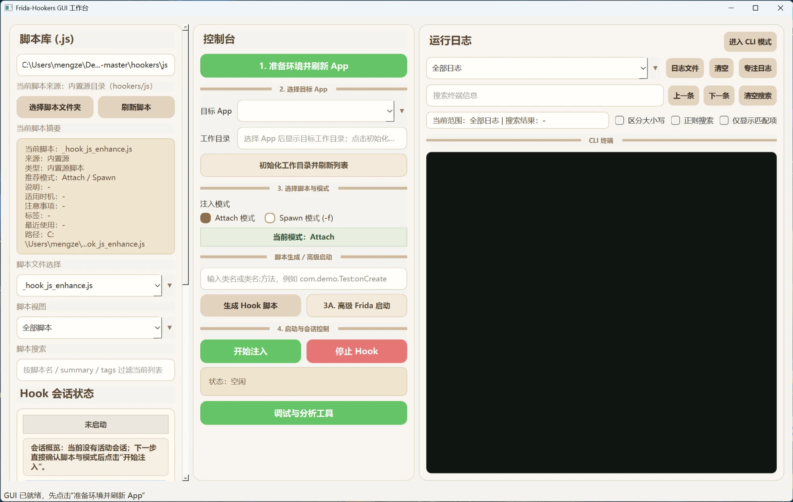
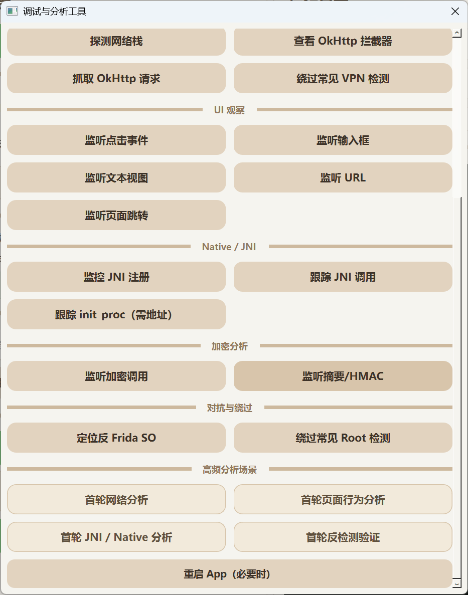
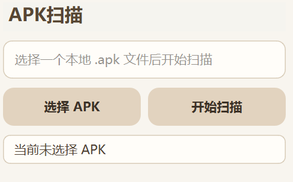
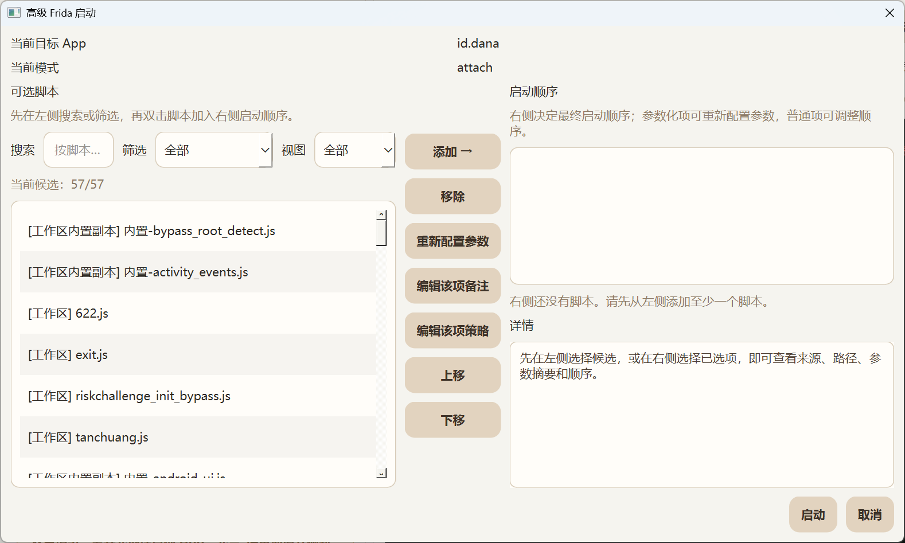

# Frida-Hookers

[](https://opensource.org/licenses/MIT)


## 你还在为重复输入 Hook 指令而烦吗？

**你还在为每次 Hook 前都要重复打开终端、反复输入相似命令而烦吗？**  
**你还在为切换不同 App 时，总要重新整理脚本、工作目录和调试环境而打断思路吗？**  
**你还在一边手动准备设备，一边在 Attach / Spawn、日志输出、页面分析之间来回切换吗？**

> 现在不用担心这些重复又繁琐的操作了。  
> 只需要点击 GUI 界面，就可以完成设备准备、目标 App 选择、脚本注入、日志查看和结果分析这整套流程。

Frida-Hookers 是一个面向 Android 动态调试的 GUI 工作台。它的重点不是替代 Frida，而是把这些高频动作收进一条更稳定、重复成本更低的桌面流程里。 

它不替代 Frida，而是把日常最常用、最容易反复手动执行的动作整理成一个更顺手的GUI工作台。

如果你经常在这些事情之间来回切换：

- 手动连接设备、确认 root、反复启动设备侧 Frida 服务
- 针对不同 App 重建工作目录、脚本副本和调试环境
- 在 Attach / Spawn、脚本修改、日志观察、页面分析之间频繁切换
- 依赖固定的 frida-server 完成设备侧 Frida 准备

那这个项目就是你最好的选择。




## Demo

GUI 主界面：


Hook 注入过程演示：


## 这个项目有什么用

`Frida-Hookers` 的价值，不是替你发明新的调试能力，而是减少你在 Android 动态调试里重复做的那些准备动作。

它把设备准备、目标 App 选择、工作目录初始化、脚本注入、日志查看和结果分析收进同一个 GUI 工作流，让你可以更快开始分析目标 App，而不是反复停在环境准备、命令输入和工具切换上。

如果你经常：

- 重复连接设备、确认 root、启动设备侧 Frida 服务
- 为不同 App 反复整理工作目录、脚本副本和 APK
- 在 Attach / Spawn、脚本调试、日志查看和页面分析之间来回切换

那这个项目的作用，就是把这套高频动作收拢起来，降低重复成本。


## 你可以怎么用它

GUI 里的常用链路基本是固定的：

1. 点击“准备环境并刷新 App”
2. 如果当前手机前台存在可识别的 App，GUI 会优先自动选中它；否则手动选择目标 App
3. 按需点击“初始化工作目录并刷新列表”
   这一步会补齐辅助 bat、确保本地 APK 副本存在，并把 `hookers/js` 中的内置脚本复制到 `workspaces/<package>/js/`，文件名前缀为 `内置-`
4. 选择已有脚本，或点击“生成 Hook 脚本”
5. 选择 Attach 或 Spawn
6. 点击“开始注入”
7. 在右侧日志区里继续查看运行结果

这条链路的价值在于，它把原本分散在命令行、脚本目录、设备终端里的动作收到了一个界面里。你切目标 App、换脚本、换注入模式时，不需要重新把整套准备流程手搓一遍。


## GUI 快速开始

### 1. 使用前准备

开始前请确认：

- Windows
- Python 3.12 或 3.13
- `adb` 已安装并且可直接执行
- Android 设备已连接
- 目标设备已 root
- 目标设备使用 frida 注入过


安装依赖：

方法一：使用 `venv`

```powershell
python -m venv .venv
.venv\Scripts\activate
pip install -r requirements.txt
```

方法二：使用 `conda`

```powershell
conda create -n hookers python=3.12 -y
conda activate hookers
pip install -r requirements.txt
```

当前项目建议固定使用这组兼容版本：

- `frida==16.2.1`
- `frida-tools==12.3.0`


### 2. 启动 GUI

请先进入你创建好的 Python 环境，再启动 GUI。

#### 方式一：venv 环境
```powershell
.venv\Scripts\activate
python app_gui.py
```
#### 方式二：conda 环境
```powershell
conda activate hookers
python app_gui.py
```

GUI 启动后不会自动准备设备环境。你进入界面后，第一步就应该是手动点击“准备环境并刷新 App”。


### 3. 第一次使用建议顺序

1. 点击“准备环境并刷新 App”
2. 在 App 下拉框里选择目标应用
3. 点击“初始化工作目录并刷新列表”
   程序会把该 App 的 APK 副本放到对应 `workspaces/<package>/`，并把内置脚本复制到 `workspaces/<package>/js/`
4. 在脚本区选择现成脚本，或者点击“生成 Hook 脚本”
5. 根据需要选择 Attach 或 Spawn
6. 点击“开始注入”
7. 点击“调试与分析工具”打开分析面板
8. 在面板里用“查看 Activity”“查看 Service”“对象信息”“对象解释”“View 信息”，以及各类快捷 Hook 按钮继续分析

## 调试与分析工具

注入开始后，绝大多数“看一眼当前状态”的分析动作都收进了 **调试与分析工具** 这一个面板里，不再散落在主界面上。



### 入口与定位

- 入口：中部控制区 **`调试与分析工具`** 按钮
- 行为：点击后弹出一个**非模态**面板，注入动作的结果仍会输出到主界面右侧日志区，弹窗期间你可以一边操作一边看日志
- 目标对象：面向**当前已选 App 的当前会话**

### 面板里有什么

- **对象分析**：输入对象 ID、类名或 View ID，再用 `对象信息` / `对象解释` / `View 信息` 查看
- **页面查询**：`查看 Activity` / `查看 Service`
- **快捷 Hook 按钮**：按“网络与抓包 / UI 观察 / Native / JNI / 加密分析 / 对抗与绕过”分组，对应 `hookers/js/` 里的内置脚本，一键注入（如 `探测网络栈`、`抓取 OkHttp 请求`、`监听页面跳转`、`监控 JNI 注册` 等）
- **重启 App（必要时）**：需要重新拉起目标 App 时使用

### 高频分析场景（一键多脚本）

面板里还有一组 **高频分析场景** 按钮，把常见的“开局摸底”动作打包成一键：点击后会按预设顺序一次性注入多个脚本，省去逐个手点。它直接沿用当前 GUI 的 Attach / Spawn 模式与当前已选 App。

| 场景按钮 | 打包脚本 | 适合什么时候用 |
|---|---|---|
| `首轮网络分析` | 探测网络栈 → 查看 OkHttp 拦截器 → 监听 URL | 第一次摸清请求链路 |
| `首轮页面行为分析` | 监听页面跳转 → 监听点击事件 → 监听文本视图 | 快速摸清当前界面交互 |
| `首轮 JNI / Native 分析` | 监控 JNI 注册 → 跟踪 JNI 调用 | Native 入口摸底 |
| `首轮反检测验证` | 定位反 Frida SO → 绕过常见 Root 检测 → 绕过常见 VPN 检测 | 开局验证是否存在反检测命中 |

> 这组场景只是“同一次注入里组合多个内置脚本”的快捷方式，结果同样输出到主界面日志区；如果想自己控制脚本与顺序，用 [高级 Frida 启动](#高级-frida-启动) 更灵活。

### 使用方式

1. 先完成 `准备环境并刷新 App` → 选择目标 App → `开始注入`
2. 点击 **`调试与分析工具`** 打开面板
3. 选择需要的查询、快捷 Hook 按钮，或直接点一个 `高频分析场景` 一键开局
4. 在主界面右侧日志区查看输出

## APK 扫描

GUI 左侧提供了一个独立的 **APK 扫描** 小工具，适合对本地 APK 做快速静态辅助检查。



### 功能说明

- 入口位置：左侧 `APK扫描`
- 使用方式：
  1. 点击 **`选择 APK`**
  2. 选择一个本地 `.apk` 文件
  3. 点击 **`开始扫描`**
- 扫描结果会输出到右侧日志区

### 适合的场景

- 快速查看 APK 的基础加固/壳相关信息
- 在真正上设备前，先做一次本地静态摸底
- 和 GUI 动态 Hook 流程配合使用，帮助判断后续优先从哪类脚本切入

## 高级 Frida 启动

GUI 当前提供了一个 **高级 Frida 启动** 对话框，用来在同一个目标 App 上按顺序组合多个脚本，再统一启动。



### 适合的场景

- 想一次性加载多个脚本，而不是一个个手动启动
- 想控制多个脚本的启动顺序
- 想把普通脚本和参数化脚本组合到同一次注入里
- 想复用当前 GUI 的 Attach / Spawn 模式，而不是手动拼完整 Frida CLI

### 当前行为

- 入口：中部控制区 **`高级 Frida 启动`**
- 目标对象：
  - 只面向**当前已选 App**
- 模式来源：
  - 直接沿用当前 GUI 的 **Attach / Spawn** 单选状态
- 当前对话框里会显示：
  - 当前目标 App
  - 当前模式
  - 可选脚本列表
  - 右侧启动顺序列表

### 使用方式

1. 先点击 **`准备环境并刷新 App`**
2. 选择目标 App
3. 按需点击 **`初始化工作目录并刷新列表`**
4. 点击 **`高级 Frida 启动`**
5. 在左侧选择脚本，点击 **`添加 →`**
6. 用：
   - `上移`
   - `下移`
   调整启动顺序
7. 点击 **`启动`**


## Frida Server

GUI 当前固定使用一个设备侧 server：

- 本地文件：`mobile-deploy/rusda-server-16.2.1-android-arm64`
- 远端路径：`/data/local/tmp/rusda-16.2.1`
- 当前实现不提供 GUI 内的 Frida 变体切换选项
- 左侧额外提供一个 `停止 Frida Server` 按钮，用于手动停止并清理当前受管 server


## 为什么默认使用 rusda？

`Frida-Hookers` 当前固定使用 `rusda-server-16.2.1` 作为设备侧 Frida 服务。  
相比直接使用原版 `frida-server`，`rusda` 的价值在于：它会对一部分常见 Frida 特征做弱化处理，用来降低高频 Frida 检测命中的概率。


## /js 脚本说明

当前脚本目录分工如下：

- `hookers/js/`
  - GUI 当前实际使用的**内置脚本源目录**
- `workspaces/<package>/js/`
  - 当前 App 的**工作区脚本目录**
  - 点击 **`初始化工作目录并刷新列表`** 后，会把 `hookers/js/` 里的内置脚本复制到这里，文件名前缀为 `内置-`，例如 `内置-okhttp.js`
  - 如果工作区里已经存在同名 `内置-xxx.js`，则会**跳过**，不会覆盖原文件

下表中的“是否内置”表示该脚本是否属于 `hookers/js/` 当前内置脚本集合；  
“按钮名称 / GUI 入口说明”表示它在 **`调试与分析工具`** 面板内是否有对应的快捷按钮，或需要通过左侧脚本列表手动选择启动。

### 页面 / Activity / View

| 脚本名 | 主要作用 | 是否内置 | 按钮名称 / GUI 入口说明 | 推荐模式 |
|---|---|---:|---|---|
| `activity_events.js` | 跟踪 Activity 生命周期，如 `onCreate`、`onResume` | 是 | `监听页面跳转` | **Attach 优先**；想抓首页启动链可用 Spawn |
| `android_ui.js` | 配合 `radar.dex` 查看 UI 结构与界面状态 | 是 | 无 | **Attach 优先** |
| `click.js` | 观察或辅助页面点击行为 | 是 | `监听点击事件` | **Attach 优先** |
| `edit_text.js` | 观察输入框内容变化与赋值/读取逻辑 | 是 | `监听输入框` | **Attach 优先** |
| `text_view.js` | 观察 TextView 文本设置与动态文本渲染 | 是 | `监听文本视图` | **Attach 优先** |
| `url.js` | 观察 URL / URI / 部分 OkHttp Builder 层 URL 构建 | 是 | `监听 URL` | 页面交互阶段用 **Attach**；启动早期请求可用 Spawn |

### 网络 / 证书 / OkHttp

| 脚本名 | 主要作用 | 是否内置 | 按钮名称 / GUI 入口说明 | 推荐模式 |
|---|---|---:|---|---|
| `just_trust_me.js` | 绕过常见 SSL Pinning / 证书校验 | 是 | 无 | **Spawn 强烈优先** |
| `okhttp.js` | Hook OkHttp 请求/响应链路，打印请求头/体与响应头/体 | 是 | `抓取 OkHttp 请求` | **Spawn 优先**；页面阶段请求可试 Attach |
| `print_okhttp_interceptors.js` | 枚举 / 打印 OkHttp 拦截器链 | 是 | `查看 OkHttp 拦截器` | **Attach / Spawn 都可以** |
| `detect_network_stack.js` | 检测目标 App 使用的网络栈，适合开局摸底 | 是 | `探测网络栈` | **Attach / Spawn 都可以** |

### 加密 / 哈希

| 脚本名 | 主要作用 | 是否内置 | 按钮名称 / GUI 入口说明 | 推荐模式 |
|---|---|---:|---|---|
| `hook_encryption_algo.js` | 观察对称/非对称加密调用，定位加密入口与密钥/明文 | 是 | `监听加密调用` | **Attach / Spawn 都可以** |
| `hook_encryption_algo2.js` | 观察摘要 / HMAC（如 MD5、SHA、HMAC）调用 | 是 | `监听摘要/HMAC` | **Attach / Spawn 都可以** |

### 环境检测 / 反检测

| 脚本名 | 主要作用 | 是否内置 | 按钮名称 / GUI 入口说明 | 推荐模式 |
|---|---|---:|---|---|
| `bypass_root_detect.js` | 绕过常见 Root 检测点 | 是 | `绕过常见 Root 检测` | **Spawn 强烈优先** |
| `bypass_vpn_detect.js` | 绕过常见 VPN / 代理检测 | 是 | `绕过常见 VPN 检测` | **Spawn 优先** |
| `find_anit_frida_so.js` | 监控 `android_dlopen_ext`，辅助定位反 Frida so | 是 | `定位反 Frida SO` | **Spawn 优先** |
| `bypass_frida_svc_detect.js` | 针对特定 Frida service 检测的专项绕过脚本 | 是 | 无 | 更偏专项场景，按目标逻辑决定，通常建议先在受控环境验证 |
| `replace_dlsym_get_pthread_create.js` | 针对 `dlsym` / `pthread_create` 检测链的专项处理脚本 | 是 | 无 | 更偏专项场景，通常用于 Native 对抗链验证 |

### Native / Dex / JNI / 加固

| 脚本名 | 主要作用 | 是否内置 | 按钮名称 / GUI 入口说明 | 推荐模式 |
|---|---|---:|---|---|
| `DumpDex.js` | 监控 Dex 加载、动态 so 加载，辅助脱壳 / 提取 | 是 | 无 | **Spawn 强烈优先** |
| `hook_register_natives.js` | Hook `RegisterNatives`，打印 JNI 动态注册信息 | 是 | `监控 JNI 注册` | **Spawn 强烈优先** |
| `apk_shell_scanner.js` | 辅助识别 APK 常见加固/壳特征 | 是 | 无 | 独立分析或 **Spawn** |
| `keystore_dump.js` | 观察/提取 keystore 相关信息 | 是 | 无 | **Attach / Spawn 都可以** |
| `jni_method_trace.js` | 跟踪指定 so 的 JNI 调用；需要先输入参数生成 runtime | 是 | `跟踪 JNI 调用`（参数化按钮） | 参数化脚本；按目标调用链选择 **Attach / Spawn** |
| `trace_init_proc.js` | 跟踪 so 初始化片段；需要先输入 `so/startAddr/endAddr` 生成 runtime | 是 | `跟踪 init_proc（需地址）`（参数化按钮） | 参数化脚本；更适合 **Spawn** 或初始化早期链路分析 |

### 设备 / 环境信息

| 脚本名 | 主要作用 | 是否内置 | 按钮名称 / GUI 入口说明 | 推荐模式 |
|---|---|---:|---|---|
| `get_device_info.js` | 收集设备与运行环境基础信息 | 是 | 无 | **Attach / Spawn 都可以** |


## 使用建议

- 想尽早拦截启动逻辑、证书校验或初始化行为时，优先试 `Spawn`
- 只是想连到已经跑起来的 App 上做观察和补充注入时，用 Attach 更直接
- 先用现成脚本验证方向，再决定是否用“生成 Hook 脚本”补定制逻辑，效率更高

## 注意事项

- 这个项目默认建立在 root + ADB + Frida 可用的前提上
- `frida-server` 必须和目标设备架构匹配
- 当前固定依赖本地 `mobile-deploy/rusda-server-16.2.1-android-arm64`
- `workspaces/` 目录属于运行时工作区，不是框架源码的一部分

## 免责声明

本项目仅用于经过授权的安全测试、学习研究与逆向分析。请在合法、合规和已获得明确授权的场景下使用。

## 参考

- [CreditTone/hooker](https://github.com/CreditTone/hooker)
- [taisuii/rusda](https://github.com/taisuii/rusda)
